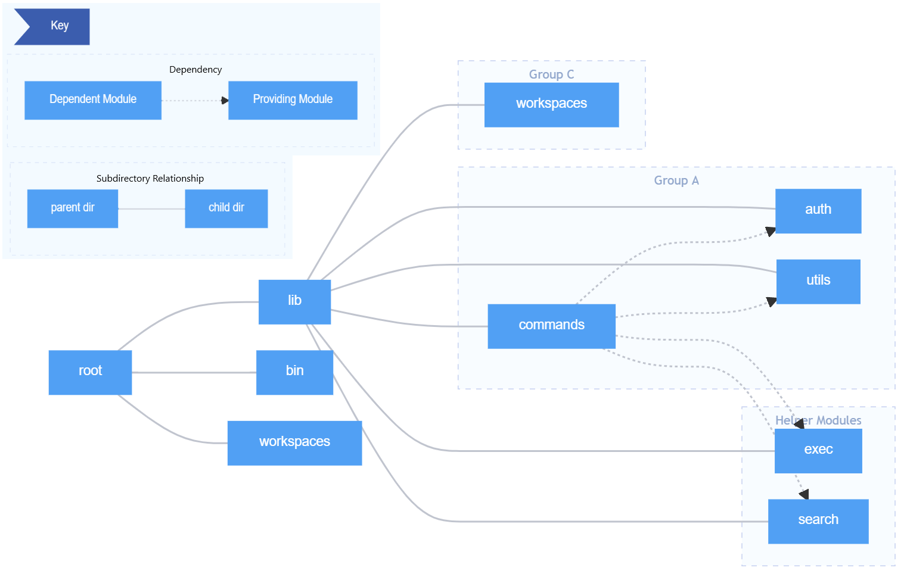

#

## Developer View

### Module organization and Codeline organization

The production modules of the npm CLI are organized in a rather flat manner, considering the amount of code supporting the application.

|  |
| :-: |
| Figure x.1: A module organization diagram for the npm cli. Each node, except for `root`, represents both a directory and a module |

The three top-level modules are `bin`, `lib`, and `workspaces`. 

`bin` is where the different npm and npx executables are kept, with different versions for each of the supported command line platforms.

`workspaces` contains ...

`lib` is where the majority of the cli's production code is found.
This module contains user-exectuable commands and the code that supports those commands in their use of workspaces and platform-specific tasks.
Conceptually, there are three groups of submodules in the `lib` module.

Group A contains the meat of the work, with the `commands`, `utils`, and `auth` submodules.
`auth`, as expected, contains authentication work.
`utils` contains platform-specific work, error handling, file reading and similar work.
`commands` is unsurprisingly where npm commands such as `install`, `start`, and `search` are found.

Group C contains a single submodule that contains a single function - one that facilitates communication between the top-level workspaces module and commands.

The final group consists of submodules that provide supporting code used for specific commands - `search` and `exec`.
These commands are the only commands that make use of their corresponding supporting submodule.

The `commands` submodule depends on every other module in the `lib` module.

### Common processing

The common processes are handling configuration parameters, checking for authorization and executing commands.

Configuration parameters are structured in a layered hierarchy based on their priority.
Sorted by priority, the config parameter contains ...

Command Line Flags are placed using the command line to set specific configuration parameters. This is done by providing a `--foo bar`, configuring the parameter `foo` to variable `bar`. 

Environment Variables are configured within `scripts`. This is done by providing a `npm_config_foo=bar`, configuring the parameter `foo` to variable `bar`.

npmrc Files are config files of an ini-formatted of `key = val` parameters. The four relevant npmrc files are per-project, per-user, global and built-in config files. 

Default Configs are a set of configuration parameters that are internal to npm, and are defaults if nothing else is specified.

### Standardization of design

### Standardization of testing

The npm CLI utilized multiple testing methods.
Smoke testing assesses an overview of the most common npm commands, while unit testing provides more coverage at the cost of being a more resource intensive testing suite to run.

`tap-snapshots` are used to automatically create valid outputs to compare to test output.
The testing programmer generates one such valid output by capturing the output of a command when they know the output to be correct, and then subsequent executions of test suites for that command will have their output compared to the snapshot.
This eases the production of both smoke and unit tests considerably.

Finally, tests are automated via github actions to facilitate Continuous Integration.

### Instrumentation
