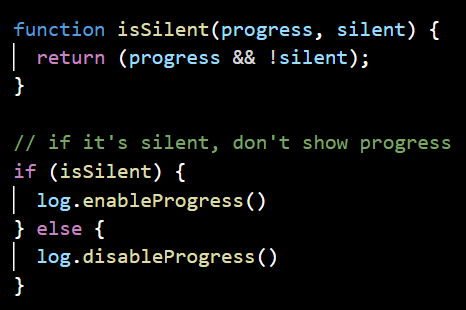

## System Improvements
- Remove dead code:
    - Location of the code smell: cli/lib/utils/did-you-mean.js/line 6. 
    - Deleted the following line of code: `const cmd = await npm.cmd(str)`
- Decompose conditional
    - Location of the code smell: cli/lib/utils/display.js/lines 64-68.
    - Decomposed the conditional statement into a function and called that function as the new conditional.

|  |
| :-: |
| Figure x.2: Picture of if statement after refactoring |