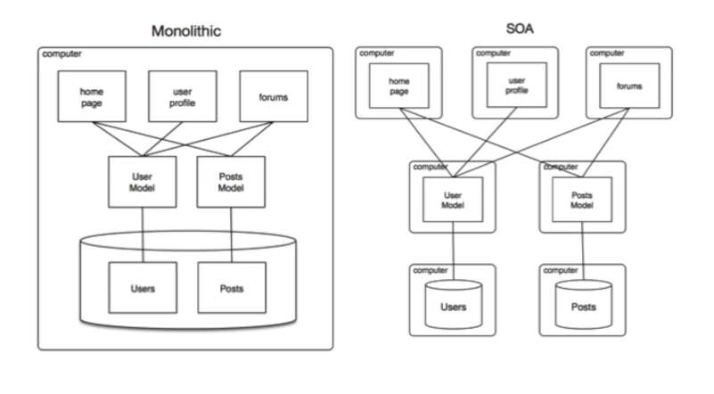

#

## Styles and Patterns

### SOA (Service-Oriented Architecture)

Design Pattern [style] in which separate components of an app are separated into standalone services that communicate by defined protocols (HTTPS). i.e., data sources communicate with only one service.

When to use: All elements within interface are implemented even when they are not needed (violating Interface Segregation Principle)

|  |
| :-: |
| Figure x.2: Basic diagram of SOA |

### Software Design Patterns

#### Mixins

The npm CLI utilizes Mixins to break down the `Arborist` class into more digestible pieces.
The `Arborist` deals with all operations on the package dependency tree.
This is quite a lot of functionality, so the different aspects of the class are separated into mixin classes such as `pruner` or `build-ideal-tree`.

The mixins are all kept in an array in the Arborist class file, and via an interesting language idiom reducing the array, the Arborist class is made to implement each mixin in the array.
So, adding or removing mixins is a simple matter of adding or removing mixins from this array (assuming code that utilizes removed mixin behavior is adjusted accordingly, of course).

Utilizing the mixin pattern here also allows for the behavior defined by each mixin to be tested separately from each other, since the testing file can make an empty class inherit from any mixin.
